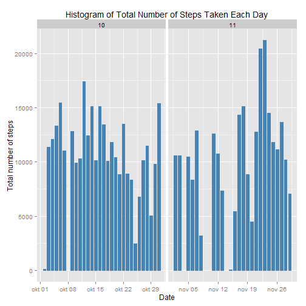

### Loading and preprocessing the data
1. Load the data (i.e. read.csv() )

```r
unzip("activity.zip")
activity_data <- read.csv("activity.csv", colClasses = c("integer", "Date", "factor"))
```
2. Process/transform the data (if necessary) into a format suitable for your analysis

```r
activity_data$month <- as.numeric(format(activity_data$date, "%m"))
noNA_data <- na.omit(activity_data)
rownames(noNA_data) <- 1:nrow(noNA_data)
head(noNA_data)
```

```
##   steps       date interval month
## 1     0 2012-10-02        0    10
## 2     0 2012-10-02        5    10
## 3     0 2012-10-02       10    10
## 4     0 2012-10-02       15    10
## 5     0 2012-10-02       20    10
## 6     0 2012-10-02       25    10
```

```r
dim(noNA_data)
```

```
## [1] 15264     4
```

```r
library(ggplot2)
```


### What is mean total number of steps taken per day?
For this part of the assignment, you can ignore the missing values in the dataset.

1. Calculate the total number of steps taken per day

```r
totalSteps <- aggregate(noNA_data$steps, list(Date = noNA_data$date), FUN = "sum")$x
```

2. Make a histogram of the total number of steps taken each day

```r
ggplot(noNA_data, aes(date, steps)) + geom_bar(stat = "identity", colour = "steelblue", fill = "steelblue", width = 0.7) + facet_grid(. ~ month, scales = "free") + labs(title = "Histogram of Total Number of Steps Taken Each Day", x = "Date", y = "Total number of steps")
```

 

3. Calculate and report the mean and median total number of steps taken per day

Mean total number of steps taken per day:

```r
mean(totalSteps)
```

```
## [1] 10766.19
```
Median total number of steps taken per day:

```r
median(totalSteps)
```

```
## [1] 10765
```


### What is the average daily activity pattern?
1. Make a time series plot (i.e. type = "l") of the 5-minute interval (x-axis) and the average number of steps taken, averaged across all days (y-axis)

```r
avgSteps <- aggregate(noNA_data$steps, list(interval = as.numeric(as.character(noNA_data$interval))), FUN = "mean")
names(avgSteps)[2] <- "meanOfSteps"

ggplot(avgSteps, aes(interval, meanOfSteps)) + geom_line(color = "steelblue", size = 0.8) + labs(title = "Time series plot of the 5-minute interval", x = "5-minute intervals", y = "Average number of steps taken")
```

 

2. Which 5-minute interval, on average across all the days in the dataset, contains the maximum number of steps?

```r
avgSteps[avgSteps$meanOfSteps == max(avgSteps$meanOfSteps), ]
```

```
##     interval meanOfSteps
## 104      835    206.1698
```


### Imputing missing values
1. Calculate and report the total number of missing values in the dataset (i.e. the total number of rows with NAs)


```r
sum(is.na(data))
```

```
## Warning in is.na(data): is.na() applied to non-(list or vector) of type
## 'closure'
```

```
## [1] 0
```

2. Devise a strategy for filling in all of the missing values in the dataset. The strategy does not need to be sophisticated. For example, you could use the mean/median for that day, or the mean for that 5-minute interval, etc.

*My strategy is to use the mean for that 5-minute interval to fill each NA value in the steps column.*

3. Create a new dataset that is equal to the original dataset but with the missing data filled in.


```r
new_data <- activity_data 
for (i in 1:nrow(new_data)) {
    if (is.na(new_data$steps[i])) {
        new_data$steps[i] <- avgSteps[which(new_data$interval[i] == avgSteps$interval), ]$meanOfSteps
    }
}

head(new_data)
```

```
##       steps       date interval month
## 1 1.7169811 2012-10-01        0    10
## 2 0.3396226 2012-10-01        5    10
## 3 0.1320755 2012-10-01       10    10
## 4 0.1509434 2012-10-01       15    10
## 5 0.0754717 2012-10-01       20    10
## 6 2.0943396 2012-10-01       25    10
```

```r
sum(is.na(new_data))
```

```
## [1] 0
```

4. Make a histogram of the total number of steps taken each day and Calculate and report the mean and median total number of steps taken per day. 


```r
ggplot(new_data, aes(date, steps)) + geom_bar(stat = "identity",
                                             colour = "steelblue",
                                             fill = "steelblue",
                                             width = 0.7) + facet_grid(. ~ month, scales = "free") + labs(title = "Histogram of Total Number of Steps Taken Each Day (no missing data)", x = "Date", y = "Total number of steps")
```

 

5 Do these values differ from the estimates from the first part of the assignment? What is the impact of imputing missing data on the estimates of the total daily number of steps?

Mean total number of steps taken per day:

```r
new_totalSteps <- aggregate(new_data$steps, 
                           list(Date = new_data$date), 
                           FUN = "sum")$x
new_mean <- mean(new_totalSteps)
new_mean
```

```
## [1] 10766.19
```
Median total number of steps taken per day:

```r
new_median <- median(new_totalSteps)
new_median
```

```
## [1] 10766.19
```
Compare the new calculated mean and median values with the values calculated before imputing missing data:

```r
old_mean <- mean(totalSteps)
old_median <- median(totalSteps)
new_mean - old_mean
```

```
## [1] 0
```

```r
new_median - old_median
```

```
## [1] 1.188679
```
**Conclusion:** *After imputing the missing data, the new mean of total steps taken per day is **equal** to that of the old mean but the new median of total steps taken per day is **greater** than that of the old median.*


### Are there differences in activity patterns between weekdays and weekends?
1. Create a new factor variable in the dataset with two levels -- "weekday" and "weekend" indicating whether a given date is a weekday or weekend day.

*Set time localization*

```r
Sys.setlocale("LC_TIME", "C")
```

```
## [1] "C"
```

```r
head(new_data)
```

```
##       steps       date interval month
## 1 1.7169811 2012-10-01        0    10
## 2 0.3396226 2012-10-01        5    10
## 3 0.1320755 2012-10-01       10    10
## 4 0.1509434 2012-10-01       15    10
## 5 0.0754717 2012-10-01       20    10
## 6 2.0943396 2012-10-01       25    10
```

```r
new_data$weekdays <- factor(format(new_data$date, "%A"))
levels(new_data$weekdays)
```

```
## [1] "Friday"    "Monday"    "Saturday"  "Sunday"    "Thursday"  "Tuesday"  
## [7] "Wednesday"
```

```r
levels(new_data$weekdays) <- list(weekday = c("Monday", "Tuesday",
                                             "Wednesday", 
                                             "Thursday", "Friday"),
                                 weekend = c("Saturday", "Sunday"))
levels(new_data$weekdays)
```

```
## [1] "weekday" "weekend"
```

```r
table(new_data$weekdays)
```

```
## 
## weekday weekend 
##   12960    4608
```

2. Make a panel plot containing a time series plot (i.e. type = "l") of the 5-minute interval (x-axis) and the average number of steps taken, averaged across all weekday days or weekend days (y-axis).


```r
avgSteps <- aggregate(new_data$steps, 
                      list(interval = as.numeric(as.character(new_data$interval)), 
                           weekdays = new_data$weekdays),
                      FUN = "mean")
names(avgSteps)[3] <- "meanOfSteps"

library(lattice)

xyplot(avgSteps$meanOfSteps ~ avgSteps$interval | avgSteps$weekdays, 
      layout = c(1, 2), type = "l",
      xlab = "Interval", ylab = "Number of steps")
```

 
